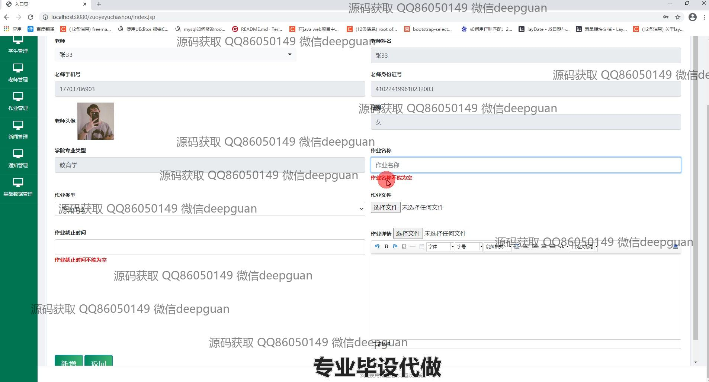
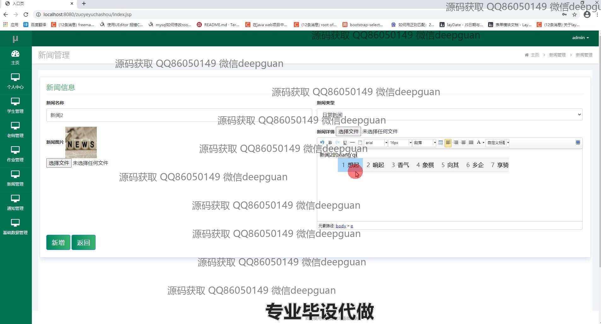
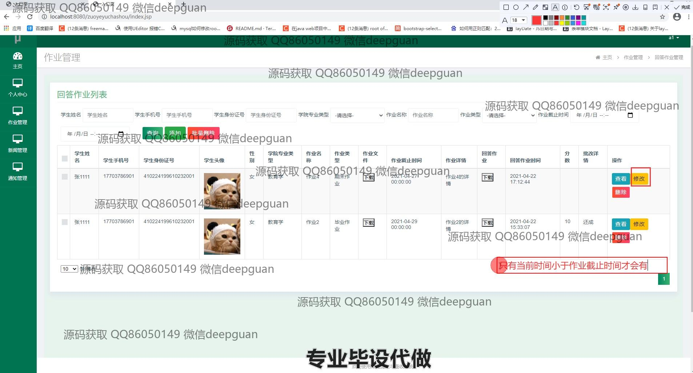

<h1 align="center">作业提交与查收系统</h1>

## 简介
作业提交与查收系统：角色分为管理员、教师、学生；功能包括学生信息管理、教师信息管理、作业类型管理、作业提交与批改、通知发布与管理、新闻管理等。    --计算机毕业设计源码；毕设源码；java毕业设计源码

## 联系方式

<h3 align="center">获取完整代码与数据库文件 + 微信：deepguan QQ: 86050149 QQ群: 783742310</h3>

<h3 align="center">可帮忙远程部署 包运行成功！提供远程部署、修改代码、设计文档指导、代码讲解等服务！</h3>

## 功能介绍（完整见运行截图）
管理员：管理员可以访问系统的管理后台，主要功能包括学生、教师和作业的管理模块，还能够查看和维护作业类型信息。管理员可以通过添加、修改和删除操作管理学生和教师信息，以及设置账户的权限和角色管理。此外，管理员能够发布系统通知和新闻，维护和查看班级数据，并进行系统设置。

教师：教师可进入系统进行学生作业的发布、查看和批改，能够进入作业管理模块查看学生提交的作业，批改后上传评语和评分。教师信息管理功能使教师可以更新个人信息并查看教学任务。教师还可以通过通知管理模块发布和管理通知，设置通知类型并撰写通知内容。

学生：学生用户在系统中主要进行作业提交和账户信息管理。系统提供学生个人信息的查看与修改功能，并支持学生上传头像和管理联系方式。通过作业管理模块，学生可以查看作业名称、类型、提交状态和截止时间，上传作业文件并查看批改反馈和评分。

访客：访客可以查看系统公开的新闻和通知公告，通过导航栏了解系统提供的基本信息和功能，获得系统使用的初步印象。在登录界面，访客可以尝试注册成为系统用户，从而获得更多访问权限。

## 运行截图

本代码来源于网络,仅供学习参考使用!

